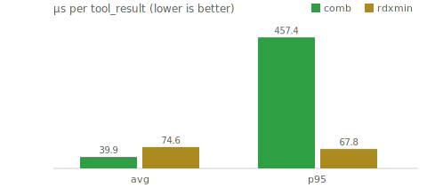

# 2026-07-18 — comb vs rdxmin latency

Deterministic replay over real Claude Code transcripts (`/Users/mattscott/.claude/projects`), 323 eligible tool_results. Wall-clock `process.hrtime` around each hook's compress function, including under-threshold calls that no-op (the real per-call cost the hook adds to every tool call, not just the ones it compresses).

**Caveat:** this measures pure function CPU time inside one shared warm process. In production each hook invocation is a separate `node script.js` process spawned by Claude Code per tool call — process-spawn overhead (tens of ms, identical for any Node-based hook) dwarfs the microsecond-level differences below. Read this as "which algorithm does less work," not "which hook feels faster."

Reproduce: `node benchmarks/speed.js`

| | n | avg µs | median µs | p95 µs | max µs | total ms |
|---|--:|--:|--:|--:|--:|--:|
| comb | 323 | 39.9 | 0.2 | 457.4 | 1183.0 | 12.9 |
| rdxmin | 323 | 74.6 | 0.2 | 67.8 | 20117.6 | 24.1 |

